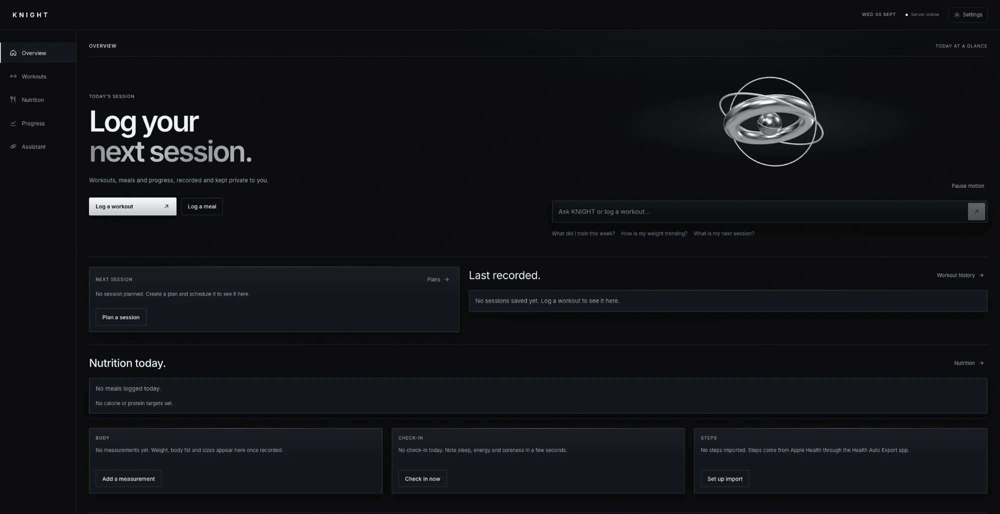
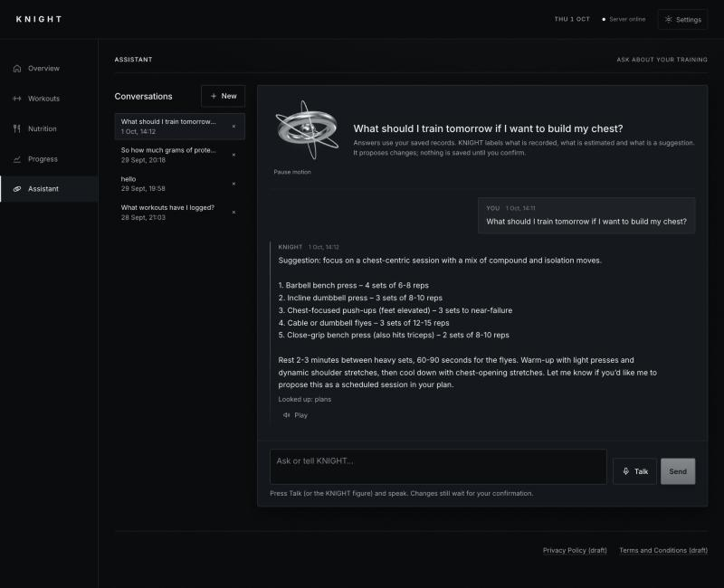
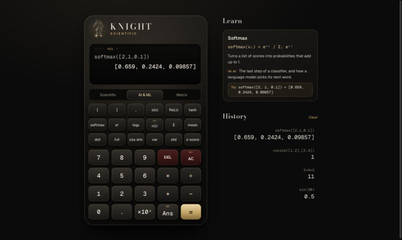

### Hi, I'm Faris

Computer Science with Artificial Intelligence student at the University of Brighton, looking for a
2027–28 placement year in software or AI engineering. I design and deliver complete products
using AI coding tools, and I'm building my own programming skills through Python (Harvard's CS50P).

---

### KNIGHT: AI fitness assistant

**[Live (invite-only)](https://knight-salkawi.onrender.com)**

Designed and delivered using AI coding tools: I defined the product, directed the build, tested
every feature and deployed it. Log workouts, meals and progress through normal screens, or just
talk to it: say *"I did three sets of ten push-ups"* and it prepares the workout for you to confirm.

- The AI can only **propose** changes. Nothing is saved until you confirm, and each change
  applies at most once.
- Replies stream in live (Server-Sent Events), and voice mode detects when you stop speaking.
- Nutrition comes from USDA FoodData Central records, never from the model's guesses.
- 379 automated tests, including checks that accounts can't see each other's data.

`React` `FastAPI` `PostgreSQL / Supabase` `Groq` `ElevenLabs` `Render`

 

---

### KNIGHT Scientific: a calculator for the maths behind AI

**[Try it live](https://knight-scientific.onrender.com)**

A 3D scientific calculator with its own expression parser (no `eval`, no maths library),
designed and delivered using AI coding tools: I defined the features, directed the build and
tested it.

- **Scientific:** order of operations, trigonometry, logs, powers, factorials, memory.
- **AI & ML:** vectors, sigmoid, ReLU, softmax, dot product, cosine similarity and statistics.
- **Matrix:** stored matrices, multiplication, determinant, inverse, transpose and rank.
- A **Learn panel** explains each function and where it is used in machine learning.

`JavaScript` `CSS 3D` `Node test runner`

---

### More projects

- **KNIGHT Private Bank (Java, JavaFX):** an ATM simulator built as a five-person team project
  in year 1 (MVC, inheritance across account types). I wrote the welcome and goodbye screens and
  the transaction history; the black-and-gold redesign and demo bank card were added later using
  AI coding tools.
- **Placement Application Tracker (Python):** deadlines, stages, requirement checklists and
  reminders exported to a phone calendar. Started as my own small script, then rebuilt using AI
  coding tools; I'm rewriting it myself as my CS50P final project.

The code for these projects is private. I'm happy to walk through it or share access on request.

---

### Right now

- Applying for 2027 placement years
- Studying Python, data structures and algorithms, and the maths behind machine learning
